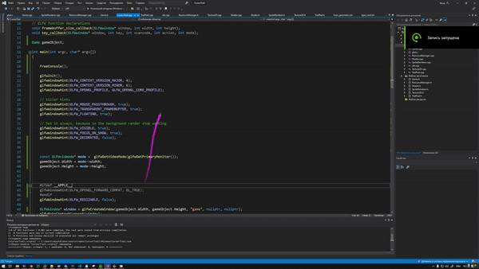

# Cursor Trail

A beautiful, customizable cursor trail effect that works across your entire desktop. Features dual rendering engines optimized for different platforms and extensive customization options.



## 🌟 Features

- **Cross-platform compatibility** (Windows, Linux, macOS)
- **Dual rendering engines**:
  - Windows: Native Win32 API with guaranteed top-level transparent overlay
  - Linux/macOS: OpenGL-based rendering
- **True transparency** with no black squares or artifacts
- **Smooth cursor tracking** with interpolated trail effects
- **Extensive customization** - size, texture, fade time, particle count, and more
- **Low CPU usage** with optimized rendering
- **Click-through support** - doesn't interfere with other applications
- **Configuration system** - file-based and command-line options

## 🎯 Windows 11 Support

This implementation specifically addresses Windows 11 transparency and overlay issues:

- ✅ **Guaranteed top-level display** - Always visible above all applications
- ✅ **True transparency** - No black background artifacts
- ✅ **Proper overlay behavior** - Works as a background overlay, not a full-screen app
- ✅ **Native Windows integration** - Uses Win32 layered windows for optimal performance

## 🎨 Customization Options

Customize your cursor trail to fit your style:

- **Texture**: Use any PNG image as the trail particle
- **Size**: Adjust particle size (1-100 pixels)
- **Spawn Frequency**: Control trail density (lower = denser trail)
- **Particle Count**: Set maximum number of trail particles (1-10000)
- **Fade Time**: How long particles last (0.1-10 seconds)
- **Fade Rate**: How fast particles disappear (0.01-1.0 per frame)

### Configuration File

Create a `config.ini` file in the same directory as the executable:

```ini
# Cursor Trail Configuration

# Trail appearance
spriteSize=15.0         # Size of trail particles (pixels)
texture=cursortrail.png # Path to trail texture image

# Trail behavior
fadeTime=1.0            # How long particles last (seconds)
fadeRate=0.05           # How fast particles fade per frame (0.0-1.0)
spawnFrequency=6.0      # Spawn interval - lower = denser trail (pixels)
maxParticles=2048       # Maximum number of particles
```

### Pre-made Configuration Examples

The repository includes several example configurations to get you started:

- **`config.ini`** - Default balanced settings
- **`config-dense.ini`** - Dense, long-lasting trail with 6000 particles
- **`config-minimal.ini`** - Subtle, quick-fading minimalist trail
- **`config-large.ini`** - Large 40px particles with wider spacing
- **`config-rainbow.ini`** - Guide for using custom colorful textures

Load any example: `CursorTrail.exe --config config-dense.ini`

### Command Line Options

Override configuration on-the-fly:

```bash
# Basic usage
CursorTrail.exe

# Customize via command line
CursorTrail.exe --size 30 --particles 4096 --density 3.0

# Load custom config
CursorTrail.exe --config my_config.ini

# Generate config file
CursorTrail.exe --save-config my_config.ini

# Show all options
CursorTrail.exe --help
```

**Available Parameters:**
- `--size <value>` - Set sprite size (default: 15)
- `--texture <path>` - Set texture path (default: cursortrail.png)
- `--fade-time <value>` - Set fade time (default: 1.0)
- `--fade-rate <value>` - Set fade rate (default: 0.05)
- `--density <value>` - Set spawn density (default: 6.0)
- `--particles <value>` - Set max particles (default: 2048)
- `--config <file>` - Load config from file
- `--save-config <file>` - Save current config to file

## 📥 Download Windows Executable

You can download a pre-compiled Windows executable from the [GitHub Actions artifacts](../../actions). Look for the latest successful build and download the `cursor-trail-windows-x64` artifact.

## 🔧 Building from Source

### Windows (Native Overlay)

1. Install CMake and Visual Studio 2022
2. Clone the repository
3. Run the build commands:
```bash
mkdir build
cd build
cmake .. -G "Visual Studio 17 2022" -A x64
cmake --build . --config Release
```

### Linux/macOS (OpenGL)

1. Install CMake and GLFW development libraries
2. Clone the repository  
3. Run the build commands:
```bash
mkdir build
cd build
cmake .. -DCMAKE_BUILD_TYPE=Release
make
```

## 🚀 Usage

### Quick Start
- **Windows**: Double-click `CursorTrail.exe` - automatically uses native overlay
- **Linux/macOS**: Run `./CursorTrail` from terminal - uses OpenGL rendering

### Basic Customization
1. Run with default settings: `CursorTrail.exe`
2. Try different sizes: `CursorTrail.exe --size 25`
3. Make it denser: `CursorTrail.exe --density 3.0`
4. More particles: `CursorTrail.exe --particles 4096`

### Advanced Customization
1. Create a `config.ini` file in the executable directory
2. Edit the values to your preference
3. Run the application - it will automatically load your config

Move your cursor to see the trail effect. To exit, close the application window or press `Ctrl+C`.

## ⚙️ Windows 11 Compatibility

This project features a complete rewrite for Windows 11 compatibility:

- **Native Win32 overlay** instead of problematic OpenGL transparency
- **Guaranteed top-level positioning** - no more hidden trails
- **True transparency** - eliminates black square artifacts
- **Global cursor tracking** using Windows API for system-wide trail

See [WINDOWS11_FIX.md](WINDOWS11_FIX.md) for detailed technical information.

## 🎨 Technical Implementation

| Platform | Technology | Transparency | Overlay Support |
|----------|------------|--------------|----------------|
| Windows | Win32 + GDI+ | Perfect | Guaranteed |
| Linux | OpenGL + GLFW | Good | Limited |
| macOS | OpenGL + GLFW | Good | Limited |

The Windows implementation uses layered windows with true alpha blending for the most reliable cursor trail experience on modern Windows systems.

